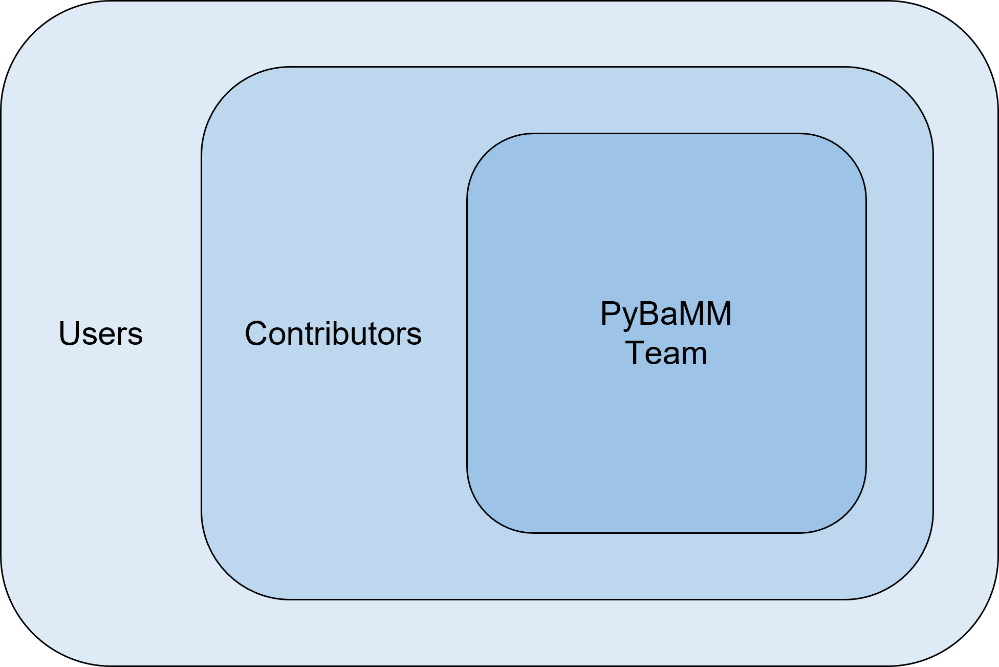
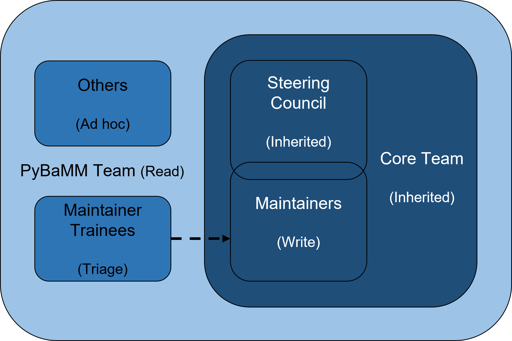

# Structure of the PyBaMM Team

## Community
The PyBaMM community is formed by all the individuals that use, develop and support the project. Here the project is understood in the broadest sense, beyond specific repositories. They can be grouped into three main categories (each one included in the previous):

1. Users: anyone who uses PyBaMM.
2. Contributors: anyone who contributes to PyBaMM (recognised by the All Contributors table). This can be non-code contributions, such as replying to issues and discussions, raising bugs, writing documentation, providing funding…
3. PyBaMM Team members: anyone with a sustained and active role in the development of the project. See below for more details.

Note that this is descriptive (rather than prescriptive) on how our community works and might evolve in time. The main places of interaction of the community are on PyBaMM's Slack workspace (through the different channels) and GitHub (through the various issues and discussions of the respective repositories).

## PyBaMM Team
The PyBaMM Team is composed by individuals with a sustained and active role in the development of the project (note that this not necessarily means coding). The members of the PyBaMM Team are listed on the [PyBaMM GitHub organisation](https://github.com/orgs/pybamm-team/people). By default members of the PyBaMM Team have "Read" permissions in GitHub.

There are various subgroups within the team structured in the following way:
* Core Team: individuals have an active role in PyBaMM (not necessarily coding) and can take part in the discussions about the project management and governance. Within the Core Team there are two additional subgroups.
    * Steering Council: governing body that makes formal decisions on the project, with the input of the Core Team.
    * [Maintainers](https://github.com/orgs/pybamm-team/teams/maintainers): technical group in charge of maintaining the various PyBaMM repositories. Their duties include (but are not limited to) fixing bugs, reviewing pull requests, answering discussions... Maintainers have GitHub "Write" permissions (or higher if needed to conduct their duties).
* [Maintainer Trainees](https://github.com/orgs/pybamm-team/teams/maintainer-trainees): developers being trained to become maintainers. Upon successful completion of the training, they progress to the Maintainers Team. Trainees have GitHub "Triage" permissions.

There might be other roles within the PyBaMM Team, such as Google Summer of Code contributors.

## Progression criteria
PyBaMM is an open community so everyone is welcome to join. Here we aim to list the ways in which individuals can progress throughout the different levels within our community. Note that the final decision on awarding a new role to an individual (or taking an existing role from them) lies with the Steering Council. We deliberately do not set arbitrary quantitative metrics to avoid encouraging behavior that plays to the metrics rather than the project's overall well-being.

Below is a description on how to achieve a certain role within the community. Note that the list is not exhaustive (i.e. the conditions below are sufficient but not necessary).
* User: `pip install pybamm` and start using the code.
* Contributor: make a significant contribution (see our [contributors table](https://github.com/pybamm-team/PyBaMM#-contributors) for examples), decision in first instance by a maintainer.
* PyBaMM Team member:
    * Core Team member: appointed by the Steering Council after proposal by a current Core Team member. The most common pathways are sustained contributions to the project or completing the maintainer training, but members can also be appointed for strategic reasons.
    * Maintainer: completion of maintainer training.
    * Maintainer trainee: apply for it. The training is run in (send an email to pybamm@gmail.com)

## What can cause loosing a certain role?
There are some circumstances that can lead to a role being removed from an individual. As with the new roles, the final decision lies with the Steering Council. Below is a list on what can cause an individual to loose a certain role:
* User: N/A.
* Contributor: serious breach of our [Code of Conduct]().
* PyBaMM Team (all roles):
    * Inactivity (one year). Reasonable notice (at least one month) must be given the individual.
    * Serious breach of our Code of Conduct.
    * Voluntary resignation.
